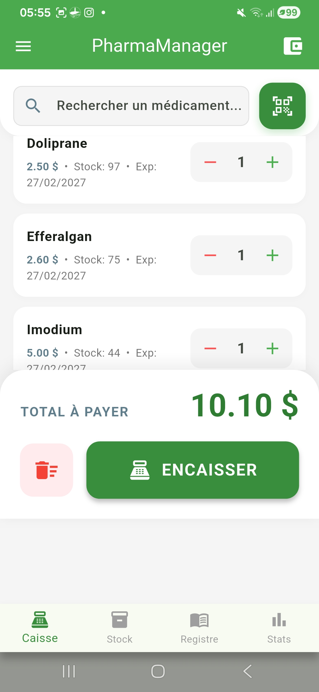
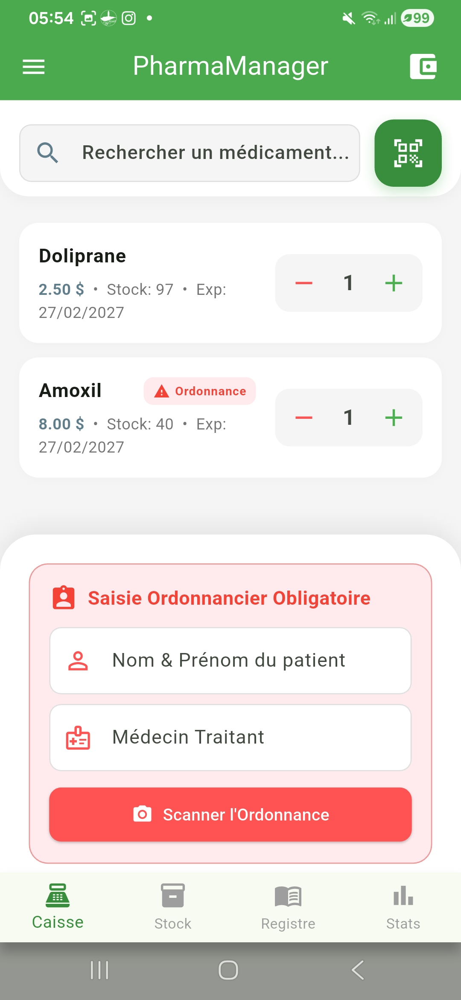
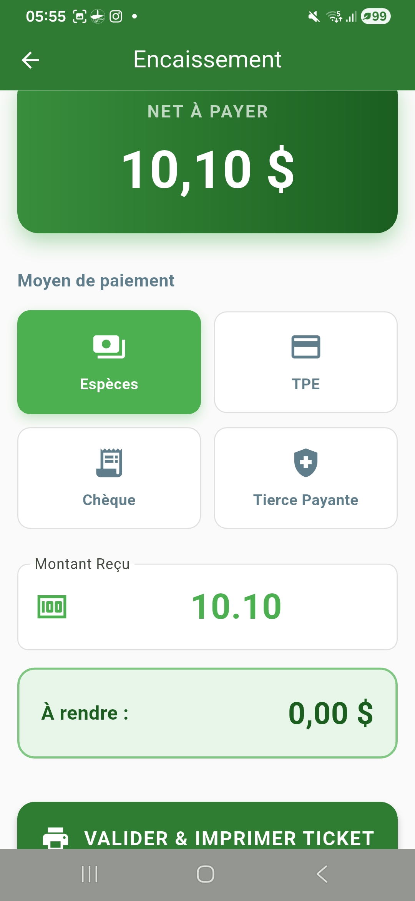

# 💊 EasyOfficinaLink

> Solution professionnelle de gestion de pharmacie  
> Moderne • Rapide • Adaptée aux réalités africaines

---

## 🚀 Présentation

**EasyOfficinaLink** est un logiciel intelligent de gestion d'officine conçu pour :

- Pharmacies indépendantes
- Cliniques
- Cabinets médicaux
- Réseaux pharmaceutiques

L’objectif est de **digitaliser entièrement la pharmacie** avec une solution simple, rapide et fiable.

---

## ✨ Fonctionnalités principales

### 📦 Gestion du stock
- Suivi en temps réel
- Alertes de rupture
- Alertes de péremption
- Stock minimum intelligent

### 🛒 Caisse (POS) rapide
- Scan code-barres caméra
- Encaissement multi-paiements
- Blocage automatique si stock insuffisant
- Gestion ordonnancier

### 👥 Gestion des utilisateurs
- Administrateur
- Pharmacien
- Caissier
- Réinitialisation des mots de passe

### 📊 Comptabilité intégrée
- Chiffre d’affaires
- Dépenses
- Bénéfice net
- Export bilan PDF

### 📂 Registre & patients
- Historique des ventes
- Photos d’ordonnances
- Fiches patients
- Alertes allergies

### 🔐 Sécurité & sauvegarde
- Base SQLite locale
- Export ZIP sécurisé
- Restauration complète
- Hachage SHA-256

---

## 🖼️ Aperçu de l’interface

> Ajoute ici tes captures si tu veux (optionnel)

```html


